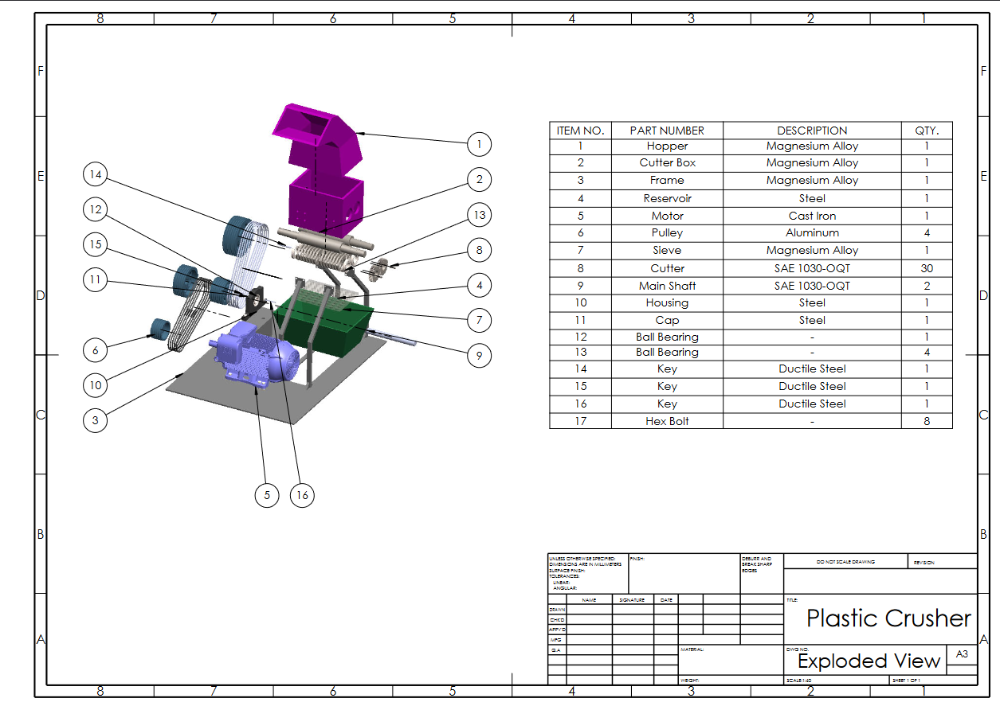
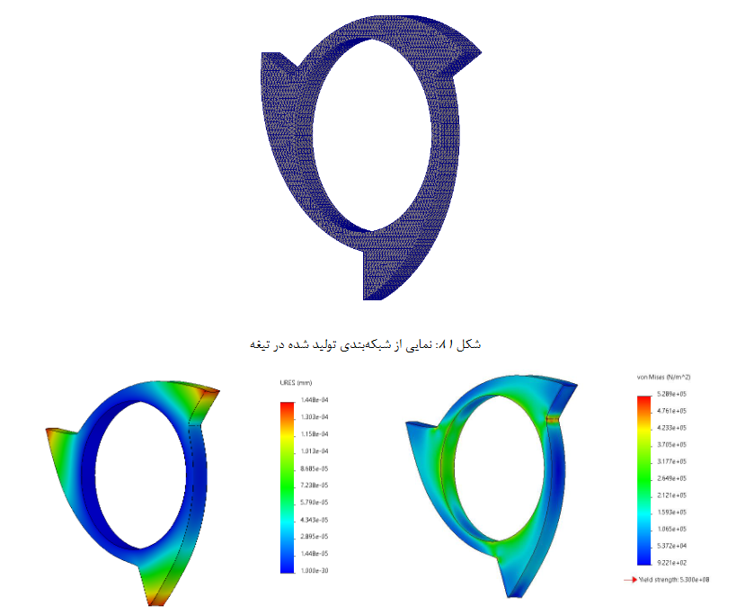
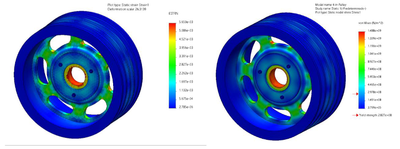
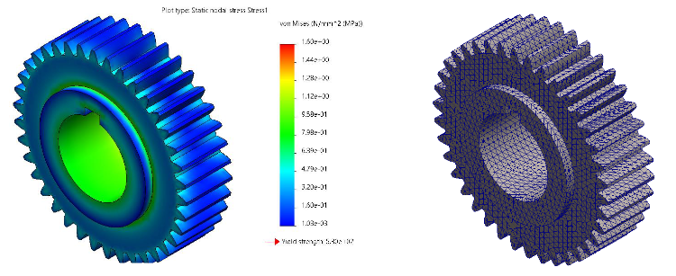
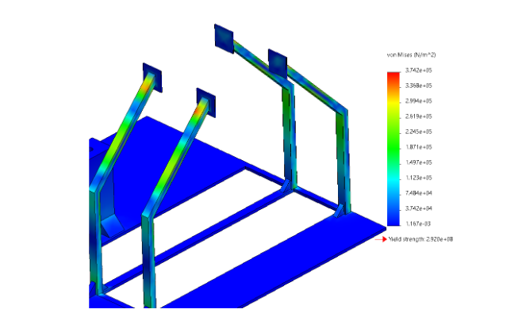

# Mechanical-Engineering-Design
Dr. Karen Abrinia
My Contributers: Peyman Sobhani, Amirhossein Ghazanfarian, Amirreza Moharrami, Sepehr Pourkhavari, Emad Gohari
<!-- Project Logo and Title -->

# Plastic Milling Machine Optimization Project

## Project Description

In this project, we focused on the optimization of a plastic milling machine. The initial phase involved calculating the force applied to the plastic mill and evaluating the stresses created in the various components. We determined the necessary dimensions and characteristics of these parts based on anticipated stresses.

Material selection was done with an emphasis on stress tolerance, and the connections between components were rigorously checked. Using advanced engineering software and finite element analysis, we precisely calculated stress tolerances. Key stages of the project included:

- **Design Optimization:** Adjusting dimensions and selecting materials for maximum efficiency.
- **Testing and Validation:** Ensuring the reliability and performance of components through testing.
- **Assembly:** Integrating all components to build the final milling machine.

The project utilized both mechanical and computational engineering methods to enhance the performance of the plastic milling machine, resulting in improved design and functionality.

 

## Features

- **Finite Element Analysis:** Accurate stress and tolerance calculations.
- **Material Optimization:** Selection of high-performance materials.
- **Efficiency Improvements:** Design adjustments for optimal performance.
- **Comprehensive Testing:** Rigorous testing and optimization of components.

## FEM Analysis Results

The Finite Element Method (FEM) was used to analyze stresses and performance of the plastic milling machine. Below are the results of the FEM analysis, showcasing various stress distributions and performance metrics.

